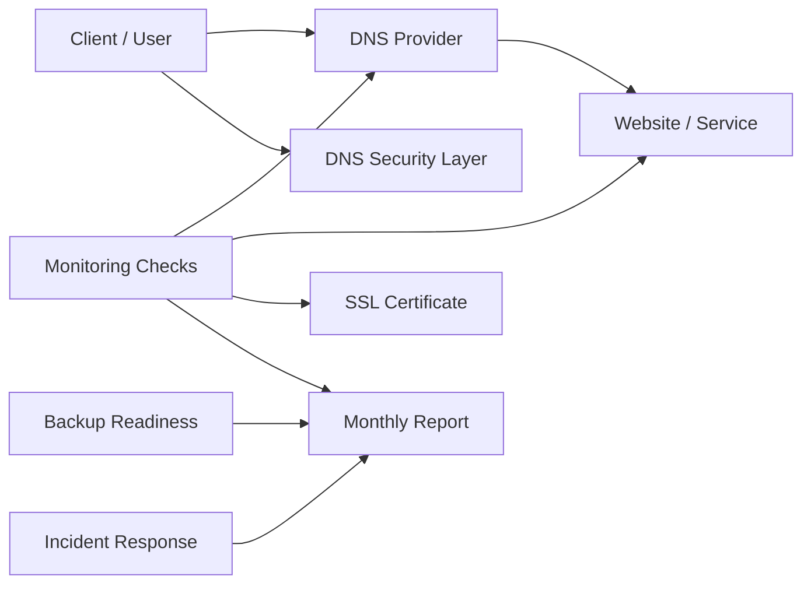

# CloudSync SafeOps - DNS Security & Uptime Operations Lab

A sanitized cybersecurity/DevOps portfolio project demonstrating a small-business security operations service: DNS protection, uptime monitoring, certificate checks, backup readiness, incident response, rollback planning, and monthly reporting.

## Overview

CloudSync SafeOps is a production-like personal lab packaged as a client-ready operations MVP. It shows how a small project can move from informal "the site seems fine" operations to a documented, measurable, and safer routine.

The repository contains public-safe documentation, example reports, monitoring target templates, incident forms, backup readiness checklists, and small read-only helper scripts. All infrastructure values are placeholders.

## Why this project exists

Small businesses and personal projects often rely on one website, one domain, and a few critical services. When DNS breaks, a certificate expires, a backup is missing, or a rollout goes wrong, the impact is immediate. CloudSync SafeOps exists to make those risks visible before they become expensive surprises.

## What problem it solves

- Reduces DNS-level exposure to common phishing and malware domains.
- Improves visibility into uptime, certificate expiry, and service health.
- Helps detect failures faster with clear monitoring targets.
- Documents backup readiness and restore expectations.
- Provides a simple incident response and rollback process.
- Produces monthly reports that non-technical clients can understand.

## Target users

- Small business websites.
- Personal brands and landing pages.
- Freelancers and local service providers.
- Small SaaS or internal tools.
- Community projects that need basic operational maturity.

## Features

- DNS security recommendations and DoH endpoint checks.
- Uptime monitoring design for HTTP, HTTPS, TCP, and DNS behavior.
- SSL/TLS certificate expiry checks.
- Backup readiness review with restore-test reminders.
- Incident response runbooks for common failure modes.
- Safe rollout process with baseline, backup, validation, and rollback.
- Monthly report template with clear status, risks, and next actions.
- Public-safe examples with sanitized domains and IP addresses.

## Architecture

The lab models a small service stack with a client-facing website, DNS provider, optional DNS filtering layer, monitoring checks, backup storage, incident workflow, and monthly reporting.

See [docs/ARCHITECTURE.md](docs/ARCHITECTURE.md) and [diagrams/architecture.mmd](diagrams/architecture.mmd).

## Service packages

- **Basic:** one website/domain, uptime monitor, SSL expiry check, monthly health report, basic incident checklist.
- **Standard:** up to three websites/domains, DNS security recommendations, uptime and certificate monitoring, backup readiness review, monthly report, incident checklist.
- **Pro:** multiple services, monitoring design, backup/restore planning, operational runbooks, monthly review, priority incident assistance.

Details: [docs/SERVICE-OFFER.md](docs/SERVICE-OFFER.md) and [docs/PRICING.md](docs/PRICING.md).

## Demo monthly report

The example report shows how a client update can stay simple: uptime summary, incidents, certificate status, DNS/security observations, backup readiness, recommendations, next actions, and an overall score.

Open [examples/monthly-report.example.md](examples/monthly-report.example.md).

## Security principles

- Keep public repositories sanitized.
- Use placeholders: `example.com`, `customer.example`, `safeops.example.com`, `doh.example.com`, `203.0.113.10`, and `REDACTED`.
- Never publish credentials, private keys, database dumps, backup archives, raw access logs, or real client records.
- Prefer read-only checks for demos and examples.
- Make changes small, reviewed, and reversible.
- Treat monitoring and backups as operational controls, not guarantees.

## Safe rollout process

1. Define the change and expected user impact.
2. Capture the current baseline.
3. Confirm backups and rollback notes.
4. Apply the smallest possible change.
5. Validate health checks and monitoring.
6. Document the result.
7. Roll back if client-facing behavior degrades.

## Backup and restore readiness

CloudSync SafeOps tracks backup coverage, retention, encryption, off-server copies, checksum verification, and restore-test status. The MVP does not store backup archives in Git.

See [docs/BACKUP-STRATEGY.md](docs/BACKUP-STRATEGY.md).

## Monitoring strategy

The MVP monitoring plan covers TCP 443, HTTP status, DNS response, DoH endpoint behavior, SSL expiry, disk usage, RAM usage, container health, backup freshness, and alert routing.

See [docs/MONITORING-PLAN.md](docs/MONITORING-PLAN.md).

## Incident response

Common scenarios include website down, DNS broken, certificate expired, disk full, backup failed, and configuration rollout issues. Each response starts with detection, triage, client communication, rollback evaluation, and a short incident report.

See [docs/INCIDENT-RESPONSE.md](docs/INCIDENT-RESPONSE.md).

## Skills demonstrated

Linux operations, Docker-aware monitoring, DNS security, DoH checks, certificate validation, backup planning, incident response, operational writing, safe rollout discipline, GitHub hygiene, public portfolio packaging, and client-oriented reporting.

## Repository map

- [docs/](docs/INDEX.md) - product, architecture, monitoring, backup, incident, onboarding, pricing, roadmap, and FAQ.
- [portfolio/](portfolio/CASE-STUDY.md) - case study and one-page pitch.
- [examples/](examples/monthly-report.example.md) - sanitized client-facing deliverables.
- [scripts/](scripts/healthcheck.example.sh) - safe read-only example checks.
- [diagrams/](diagrams/architecture.mmd) - Mermaid diagrams.
- [landing/](landing/index.html) - static portfolio landing page.

## Roadmap

- Add automated report generation from monitoring exports.
- Add a small dashboard mockup.
- Add restore-test evidence templates.
- Add more client onboarding examples.
- Add optional integrations for alerting channels.

## Disclaimer

This is a sanitized portfolio MVP and operations template. It reduces risk, improves visibility, and supports safer recovery, but it is not a managed SOC, antivirus product, legal compliance package, or guarantee of full protection. All examples use placeholders only.
